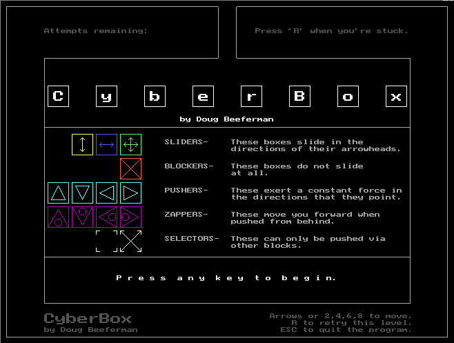



## CyberBox in VB6

### Description

This is a recreation of CyberBox. The original was written in C++ by Doug Beeferman and ran on DOS. A good portion of this code was written by David Yang. His work is greatly appreciated. I have tried to stay as close to the original as possible. The main reason I even began this project was so I could have a working Windows version as my DOS version from Mr. Beeferman doesn&#8217;t work correctly under the pseudo-DOS found in Microsoft&#8217;s Windows XP (font problem).

There was a couple of annoying things wrong with this program that was taken care of by Paul Bahlawan. I would like to thank him for this work!

  

The object of CyberBox is simple. You are trying to escape through the "hall" at the top of the board in the smallest number of moves. In your way are boxes which you must move out of your way. The opening screen explains the boxes to you. It is possible to get stuck in the levels by moving a box in the wrong place, so you have the option to retry a level but only a certain number of retries are allotted to you so use them wisely and try not to get stuck. That is pretty much the whole point and object of this game.

KEYS

Arrows To move ' each time an arrow key is pressed it counts as one move... even if the little guy goes no where.

A To see the about form

I To see the instructions form

R To retry the current level - you got four

Escape To Exit the program

L Is a cheat To progress through levels without playing them 'possibly going to be removed in a later release.

THE MAJOR CHANGE IN THIS UPDATED RELEASE IS THAT EVERYTHING [BITMAPS, LEVELS, ETC] IS INTERNALIZED.

This zip file is Desktop Friendly&#8482;. Again, Thanks to David Yang and Paul Bahlawan for their work. And also, thanks to Doug Beeferman for your original program.
 
### More Info
 

             |
---                |---
**Submitted On**   |2006-01-15 15:30:36
**By**             |[Ivan S\. Ramey](https://github.com/Planet-Source-Code/PSCIndex/blob/master/ByAuthor/ivan-s-ramey.md)
**Level**          |Intermediate
**User Rating**    |5.0 (35 globes from 7 users)
**Compatibility**  |VB 6\.0
**Category**       |[Games](https://github.com/Planet-Source-Code/PSCIndex/blob/master/ByCategory/games__1-38.md)
**World**          |[Visual Basic](https://github.com/Planet-Source-Code/PSCIndex/blob/master/ByWorld/visual-basic.md)
**Archive File**   |[CyberBox\_i1965461152006\.zip](https://github.com/Planet-Source-Code/ivan-s-ramey-cyberbox-in-vb6__1-63910/archive/master.zip)

